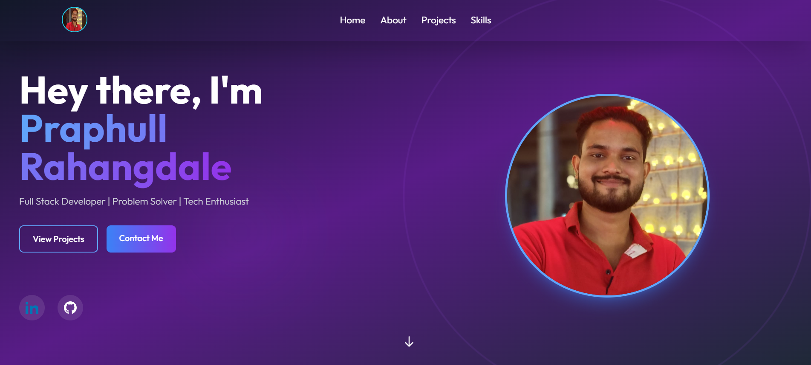

# Praphull Rahangdale - Portfolio



A modern, responsive portfolio website showcasing my skills, projects, and professional journey as a frontend developer.

## Features

- **Responsive Design**: Works seamlessly on all devices
- **Modern UI**: Clean, professional interface with smooth animations
- **Project Showcase**: Highlighting my best work with tech stack details
- **Interactive Elements**: Smooth scrolling, hover effects, and transitions
- **Dark Mode**: Eye-friendly dark theme with gradient accents

## Technologies Used

- **Frontend**:
  - React.js
  - Tailwind CSS
  - Framer Motion (for animations)
  - React Icons

## Components Breakdown

1. **Header**
   - Hero section with introduction
   - Profile picture with border animation
   - Social media links

2. **About**
   - Professional summary
   - Skills matrix with icons
   - Education timeline

3. **Projects**
   - Interactive project cards
   - Tech stack badges
   - Live demo and GitHub links

4. **Experience**
   - Professional timeline
   - Company logos and descriptions

5. **Footer**
   - Minimal contact information
   - Social links
   - Copyright notice

## Installation

To run locally:

```bash
git clone https://github.com/Praphull2005/portfolio.git
cd portfolio
npm install
npm start